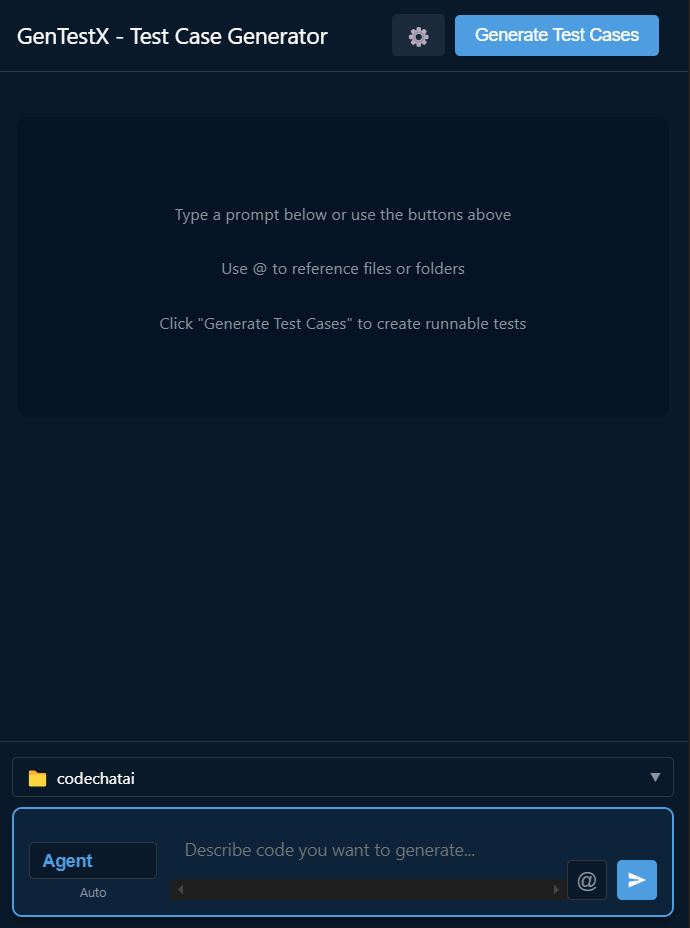
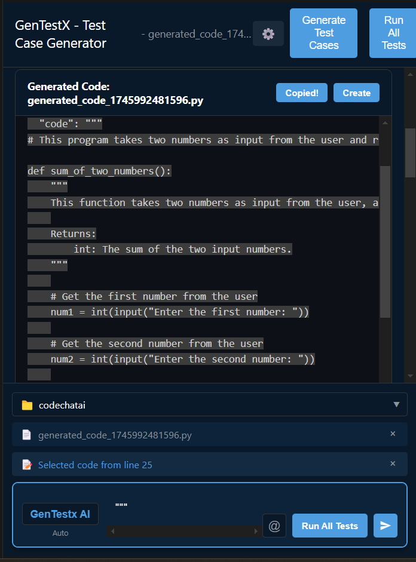
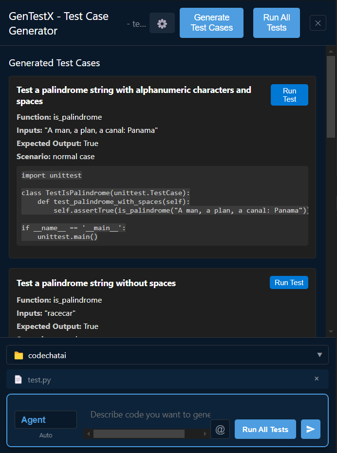
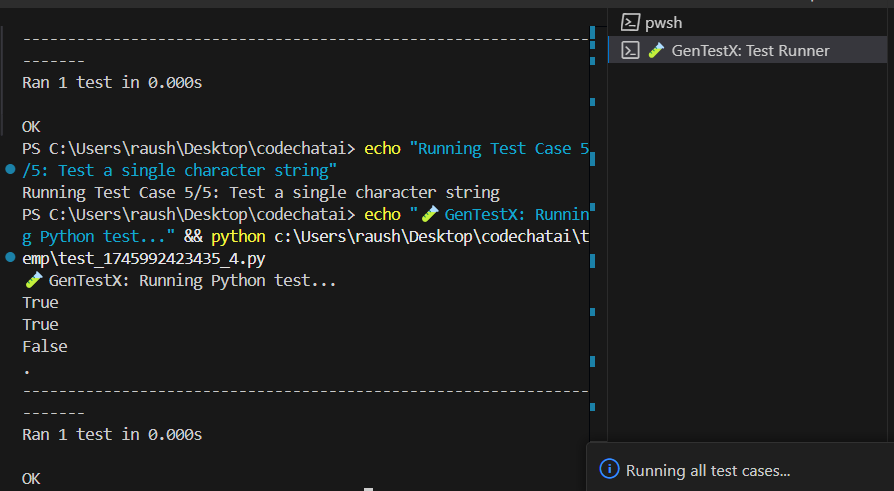
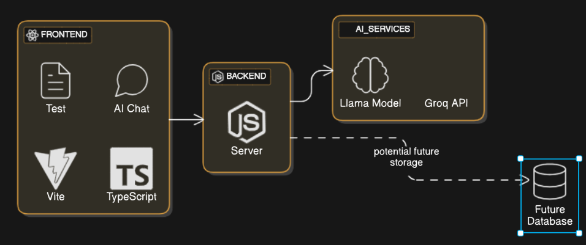
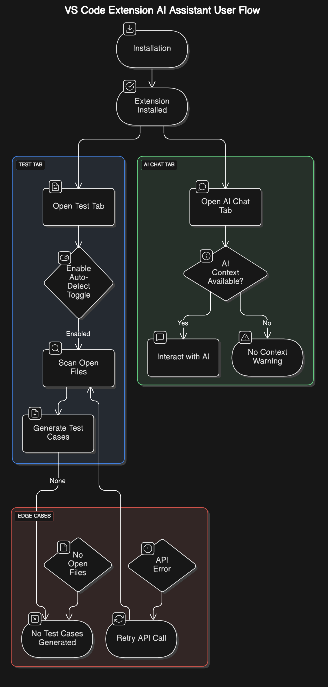

# GenTestx 

> An intelligent VS Code extension that revolutionizes development with AI-powered test generation, code assistance, and debugging capabilities.
>
> Report url:(https://docs.google.com/document/d/19SeW2uHv5ePcXSPM7heLZte7jqA-UjFcb_oJefP0Quo/edit?tab=t.d9j45ur6595b)

## 📋 Table of Contents

- [Overview](#overview)
- [Key Features](#key-features)
- [Installation](#installation)
- [Getting Started](#getting-started)
- [Detailed Usage](#detailed-usage)
- [User Interface](#user-interface)
- [Keyboard Shortcuts](#keyboard-shortcuts)
- [Extension Settings](#extension-settings)
- [Technical Requirements](#technical-requirements)
- [Use Cases](#use-cases)
- [Advanced Features](#advanced-features)
- [System Architecture](#system-architecture)
- [HCI Design Principles](#hci-design-principles)
- [Performance Considerations](#performance-considerations)
- [Team](#team)
- [Development Roadmap](#development-roadmap)
- [Troubleshooting](#troubleshooting)
- [Known Issues](#known-issues)
- [FAQ](#faq)
- [Contributing](#contributing)
- [License](#license)
- [Acknowledgements](#acknowledgements)

## Overview

GenTestx AI is a sophisticated AI-driven peer programming assistant designed to enhance developer productivity across all skill levels. By combining advanced AI algorithms with a seamless VS Code integration, this extension provides intelligent code assistance, automated test generation, and real-time debugging support in a wide range of programming languages.

### Vision Statement

To empower developers with an AI-driven tool that accelerates development workflows, improves code quality, and makes software testing accessible and efficient.

### Target Users

- **Beginner Programmers**: Benefit from learning assistance and best practices guidance
- **Professional Developers**: Increase productivity with automated testing and intelligent suggestions
- **Technical Leads**: Ensure code quality and consistent testing practices across teams
- **Educators**: Demonstrate proper testing techniques and coding standards to students

### Pain Points Addressed

- **Time-Consuming Testing**: Manual test writing is tedious and often skipped
- **Learning Curve Barriers**: Difficulty mastering new programming languages and frameworks
- **Debugging Complexity**: Identifying and fixing issues efficiently
- **Code Quality Assurance**: Maintaining high standards consistently
- **Collaborative Challenges**: Synchronizing development efforts in distributed teams

## Key Features

### 🧪 AI-Powered Test Generation

- **Comprehensive Test Coverage**: Automatically generates up to 10 diverse test cases for your code
- **Multi-Category Testing**: Supports unit tests, integration tests, edge cases, and performance tests
- **Real-Time Generation**: Creates tests as you code with intelligent file tracking
- **Test Templates**: Provides language-specific test frameworks and patterns
- **Coverage Analysis**: Identifies untested code paths and suggests additional tests

### 💬 Interactive AI Chat Interface

- **Context-Aware Assistance**: AI understands your codebase for relevant suggestions
- **Code Explanations**: Get detailed explanations of complex code segments
- **Learning Resources**: Access programming concepts and best practices information
- **Refactoring Suggestions**: Receive recommendations for code improvement
- **Syntax Guidance**: Get language-specific syntax help and examples

### 🖥️ Integrated Terminal

- **Dedicated Environment**: Custom terminal directly within the extension
- **Test Execution**: Run and monitor tests without context switching
- **Command History**: Access previously used commands
- **Customizable Interface**: Adjust terminal settings to your preferences
- **Output Filtering**: Focus on relevant information with output filtering options

### ⚡ Productivity Quick Actions

- **Keyboard-Driven Workflow**: Comprehensive shortcuts for common actions
- **Code Snippets**: Insert commonly used test patterns
- **Batch Operations**: Apply actions to multiple tests simultaneously
- **Context Menu Integration**: Right-click access to common features
- **Status Notifications**: Receive unobtrusive updates on background processes

### 🎯 Intelligent Test Management

- **Organized Test Suite**: Modern tabbed interface with categorized tests
- **Visual Status Tracking**: Clear indicators for pending, passed, and failed tests
- **Test Metrics**: Track test performance and execution time
- **History Tracking**: Review previous test results and changes
- **Export Capabilities**: Save and share test results in various formats

### 🔄 Adaptive Real-Time Updates

- **Smart Auto-Detection**: Monitors code changes and suggests relevant updates
- **Background Processing**: Performs operations without interrupting workflow
- **Detailed Progress Indicators**: Shows operation status with percentage completion
- **Comprehensive Notifications**: Provides clear success/failure feedback
- **Error Recovery**: Suggests solutions for failed operations

## Installation

### From VS Code Marketplace

1. Launch VS Code
2. Access the Extensions view by clicking the Extensions icon in the Activity Bar or pressing `Ctrl+Shift+X`
3. Search for "GenTestx AI"
4. Click "Install" to add the extension to your environment
5. Reload VS Code when prompted

### Manual Installation

1. Download the `.vsix` file from our [GitHub releases page](https://github.com/codetestai/codetestai/releases)
2. In VS Code, navigate to Extensions view
3. Click the "..." in the top-right corner
4. Select "Install from VSIX..."
5. Choose the downloaded file and follow the prompts

### Post-Installation Setup

1. After installation, you'll see the GenTestx AI icon in your Activity Bar
2. Click the icon to open the GenTestx AI sidebar
3. Configure API keys if prompted (detailed in the Extension Settings section)
4. Review default settings and adjust as needed for your workflow

## Getting Started

### Quick Start Guide

1. Open a code file in VS Code that you want to test
2. Click the GenTestx AI icon in the activity bar to open the extension panel
3. Choose either the "Test Cases" or "AI Chat" tab based on your immediate needs
4. For immediate test generation, press `Ctrl+Shift+T` (`Cmd+Shift+T` on macOS)
5. Review the generated tests in the Test Cases panel

### First-Time Configuration

1. Access Extension Settings via the gear icon in the GenTestx AI panel
2. Set your preferred programming languages for prioritized support
3. Adjust the maximum number of test cases to generate per file
4. Configure auto-detection sensitivity if desired
5. Save settings and restart the extension if prompted

### Workspace Integration

1. GenTestx AI automatically detects project structure for contextualized assistance
2. For repository-level configuration, create a `.GenTestxai` configuration file
3. Specify ignored files/directories and custom test framework settings
4. The extension will respect existing test configurations and frameworks

## Detailed Usage

### Test Generation Workflows

#### Auto-Detection Mode

1. Enable auto-detection using the toggle switch in the GenTestx AI panel
2. As you write or modify code, the extension analyzes changes in real-time
3. When significant changes are detected, tests are automatically generated
4. A notification appears when new tests are available for review
5. Click "Review Tests" to examine, modify, and accept generated tests

#### Manual Selection Mode

1. Select specific code segments you want to test
2. Press `Ctrl+Shift+T` (`Cmd+Shift+T` on macOS) to generate tests for selection
3. Alternatively, right-click and select "Generate Tests with GenTestx AI"
4. Review tests in the Test Cases panel
5. Edit tests directly or accept as-is with the "Accept" button

#### Project-Wide Testing

1. Navigate to the GenTestx AI panel
2. Click "Project Analysis" to scan the entire project
3. Select directories or files to include in the analysis
4. Click "Generate Project Tests" to create comprehensive test coverage
5. Review and manage generated tests in the test explorer view

### AI Chat Interaction

#### Code Assistance

1. Select code you want help with or place cursor at relevant position
2. Open Chat panel via `Ctrl+Shift+C` (`Cmd+Shift+C` on macOS)
3. Type your question or select from suggested queries
4. Review AI responses with embedded code suggestions
5. Apply suggestions directly to your code with the "Apply" button

#### Learning & Documentation

1. Highlight unfamiliar code or concepts
2. Right-click and select "Explain with GenTestx AI"
3. Review the explanation in the Chat panel
4. Ask follow-up questions for deeper understanding
5. Save explanations to your knowledge base for future reference

#### Debugging Support

1. When encountering errors, select the problematic code
2. Click "Debug with AI" in the extension panel
3. The AI will analyze the issue and suggest potential fixes
4. Apply solutions directly or modify them as needed
5. Run tests to verify the fix resolves the issue

### Using the Integrated Terminal

1. Access the terminal tab in the GenTestx AI panel
2. Execute test commands directly in the integrated environment
3. View test outputs and results without switching context
4. Use the history feature to rerun previous commands
5. Filter output to focus on specific test results or errors

### Test Management Features

#### Test Organization

1. Browse tests by category (unit, integration, edge case) in the Test Explorer
2. Use the search function to find specific tests
3. Group tests by file, function, or custom tags
4. Drag and drop to reorder tests for prioritization
5. Bookmark critical tests for quick access

#### Test Execution

1. Run all tests with the "Run All" button or `Ctrl+Shift+R` (`Cmd+Shift+R` on macOS)
2. Execute individual tests by clicking the play button beside each test
3. Schedule automated test runs at configurable intervals
4. Set conditional test execution based on code changes
5. View detailed execution logs and performance metrics

#### Result Analysis

1. Review test results with color-coded status indicators
2. Expand failed tests to see detailed error information
3. Compare current results with previous test runs
4. Generate coverage reports highlighting tested/untested code
5. Export results in various formats (JSON, HTML, PDF)

## User Interface

GenTestx AI features an intuitive, modern interface divided into three primary components:

### Chat Mode

The AI Chat interface provides:
- Context-aware code assistance
- Syntax highlighting for code blocks
- One-click suggestion application
- Conversation history with search capabilities
- Custom query templates for common questions

### Test Mode

The Test generation and management interface includes:
- Category-based test organization
- Visual status indicators for test results
- Code preview with syntax highlighting
- Inline test editing capabilities
- Drag-and-drop test reordering
- Filter and search functionality

### Integrated Terminal

The custom terminal environment offers:
- Dedicated command execution environment
- Syntax highlighting for common languages
- Command history and autocompletion
- Output filtering and search
- Split panel view for simultaneous code and result viewing

## Keyboard Shortcuts

| Action | Windows/Linux | macOS | Description |
|--------|---------------|-------|-------------|
| Generate Tests | `Ctrl+Shift+T` | `Cmd+Shift+T` | Create tests for selected code or current file |
| Run Tests | `Ctrl+Shift+R` | `Cmd+Shift+R` | Execute all or selected tests |
| Accept Suggestions | `Ctrl+Shift+A` | `Cmd+Shift+A` | Apply AI code suggestions to editor |
| Reject Suggestions | `Ctrl+Shift+X` | `Cmd+Shift+X` | Dismiss current AI suggestions |
| Open Chat | `Ctrl+Shift+C` | `Cmd+Shift+C` | Launch or focus the AI chat interface |
| Debug Tests | `Ctrl+Shift+D` | `Cmd+Shift+D` | Run tests in debug mode with breakpoints |
| Quick Settings | `Ctrl+Shift+,` | `Cmd+Shift+,` | Open extension settings |
| Toggle Terminal | `Ctrl+Shift+` | `Cmd+Shift+` | Show/hide the integrated terminal |
| Focus Test Explorer | `Ctrl+Shift+E` | `Cmd+Shift+E` | Navigate to test explorer panel |
| Save Current Tests | `Ctrl+Shift+S` | `Cmd+Shift+S` | Save all pending test changes |

## Extension Settings

Access settings through the VS Code settings menu or the gear icon in the GenTestx AI panel.

### Core Settings

* `GenTestxai.autoDetect`: Enable/disable automatic test generation (default: true)
* `GenTestxai.maxTestCases`: Maximum number of test cases to generate per file (default: 10)
* `GenTestxai.showStatusBar`: Show/hide status bar item (default: true)
* `GenTestxai.defaultLanguage`: Preferred programming language for ambiguous files (default: "auto-detect")
* `GenTestxai.apiKey`: Your GenTestx AI API key for extended features

### Advanced Configuration

* `GenTestxai.testFrameworks`: Specify preferred test frameworks by language
* `GenTestxai.testLocation`: Define where generated tests should be saved
* `GenTestxai.ignorePaths`: File patterns to exclude from analysis
* `GenTestxai.terminalSettings`: Customize integrated terminal appearance and behavior
* `GenTestxai.aiModel`: Select AI model for assistance (standard or advanced)
* `GenTestxai.autoSave`: Control whether to automatically save generated tests
* `GenTestxai.telemetry`: Enable/disable anonymous usage data collection

## Technical Requirements

### Minimum Requirements

- **VS Code Version**: 1.85.0 or higher
- **Operating System**: Windows 10+, macOS 10.15+, Ubuntu 18.04+
- **Node.js**: 18.x or higher

### Compatibility

- **Programming Languages**: JavaScript, TypeScript, Python, Java, C#, Ruby, Go, PHP, Rust, C/C++
- **Test Frameworks**: Jest, Mocha, Jasmine, pytest, JUnit, NUnit, RSpec, Go test, PHPUnit, Cargo test
- **Project Types**: Compatible with most VS Code supported projects

## Use Cases

### Developer Workflows

#### Individual Developer

- **TDD Workflow**: Generate tests before implementation to guide development
- **Code Refactoring**: Ensure functionality remains intact during restructuring
- **Legacy Code Updates**: Add tests to existing codebases to enable safe updates
- **Language Learning**: Get assistance when working with unfamiliar languages
- **Performance Optimization**: Test code efficiency with performance test cases

#### Team Collaboration

- **Code Review Assistance**: Use AI-generated tests as quality benchmarks
- **Onboarding Acceleration**: Help new team members understand codebase through tests
- **Standardization**: Enforce consistent testing practices across the team
- **Knowledge Sharing**: Document code behavior through comprehensive tests
- **Continuous Integration**: Integrate generated tests into CI/CD pipelines

### Educational Applications

- **Teaching Testing Practices**: Demonstrate proper test case design
- **Algorithm Understanding**: Visualize code behavior through test cases
- **Skill Assessment**: Compare student solutions against standardized tests
- **Interactive Learning**: Provide immediate feedback on code correctness
- **Concept Demonstration**: Show different testing approaches for various scenarios

## Advanced Features

### Custom Test Templates

Create and save reusable test templates for specific use cases:
1. Navigate to Settings > GenTestx AI > Templates
2. Define template structure with placeholders for dynamic content
3. Specify applicability rules (language, file patterns)
4. Access via the Templates dropdown in the Test panel

### Test Migration

Convert between different test frameworks:
1. Select existing tests in their current framework
2. Choose "Migrate Tests" from the context menu
3. Select target framework from available options
4. Review converted tests and apply changes

### Test Analytics

Access statistics about your testing practices:
1. Open the Analytics tab in the GenTestx AI panel
2. View metrics on test coverage, quality, and execution time
3. Identify trends and areas for improvement
4. Export reports for team review

### AI Training

Improve AI suggestions with your feedback:
1. Rate generated tests and suggestions
2. Provide explicit corrections when needed
3. The system adapts to your preferences over time
4. Access personalized settings in the AI configuration panel

## System Architecture

### Core Components

- **VS Code Extension**: User interface and integration with the editor
- **Frontend Client**: React.js-based UI for interactive components
- **Backend Service**: Node.js with Express handling requests and AI interactions
- **AI Engine**: Python-based LLM & NLP models for code analysis and generation
- **Database Layer**: MongoDB for storing user preferences, history, and test data
- **Authentication System**: Secure OAuth implementation (planned feature)

### Data Flow Architecture

1. User interacts with the VS Code interface
2. Extension captures code context and user actions
3. Requests are processed by the backend service
4. AI models analyze code and generate appropriate responses
5. Results are stored in the database and displayed to the user
6. Feedback loops improve AI performance over time

### Integration Points

- **VS Code API**: Deep integration with editor capabilities
- **Source Control**: Git integration for tracking test changes
- **Testing Frameworks**: Native support for popular frameworks
- **CI/CD Systems**: Hooks for Jenkins, GitHub Actions, etc.
- **Code Analysis Tools**: Complementary integration with linters and analyzers

## HCI Design Principles

### User-Centric Approach

- **Contextual Intelligence**: Adaptive interface based on user activity
- **Progressive Disclosure**: Complex features revealed gradually as needed
- **Personalization**: Remembers user preferences and adapts accordingly
- **Accessibility**: Designed for keyboard navigation and screen readers
- **Internationalization**: Support for multiple languages planned

### Cognitive Load Reduction

- **Task Simplification**: Complex operations broken into manageable steps
- **Visual Cues**: Clear icons and color coding for status indication
- **Consistent Patterns**: Familiar interaction models throughout the extension
- **Focus Management**: Directs attention to relevant information
- **Error Prevention**: Proactive validation before operations are executed

### Feedback Mechanisms

- **Immediate Response**: Visual feedback for all user actions
- **Progress Indication**: Clear status for long-running operations
- **Error Recovery**: Helpful guidance when issues occur
- **Success Confirmation**: Positive reinforcement for completed tasks
- **Learning Prompts**: Contextual tips for feature discovery

## Performance Considerations

### Optimization Strategies

- **Lazy Loading**: Components loaded only when needed
- **Background Processing**: Heavy computations run asynchronously
- **Caching**: Frequently used data stored locally
- **Incremental Updates**: Only changed portions refreshed
- **Resource Management**: Careful memory and CPU usage monitoring

### Scalability

- **Modular Architecture**: Components can scale independently
- **Load Balancing**: Distribution of AI processing tasks
- **Connection Pooling**: Efficient database connections
- **Request Throttling**: Prevention of system overload
- **Graceful Degradation**: Core functionality preserved under stress

## Team

The GenTestx AI project is developed by:

- **Divyansh** - Project Lead & Backend Architecture
- **Raushan** - AI Integration & Algorithm Design
- **Shadab** - Frontend Development & UX Design

## Development Roadmap

### Phase 1: Foundation (Current)

- ✅ Core test generation functionality
- ✅ Basic AI chat assistance
- ✅ VS Code integration
- ✅ Support for major programming languages
- ✅ Integrated terminal environment

### Phase 2: Enhancement (Q3 2025)

- 🚧 Microsoft Azure integration for AI model hosting
- 🚧 Improved UI/UX with customizable themes
- 🚧 Enhanced multi-language support for niche languages
- 🚧 Robust authentication system
- 🚧 Performance optimization for large codebases

### Phase 3: Expansion (Q1 2026)

- 📝 Real-time multi-user collaboration
- 📝 Cloud synchronization of settings and history
- 📝 Extended IDE support (JetBrains, Eclipse)
- 📝 Advanced analytics dashboard
- 📝 API for third-party integrations

### Phase 4: Enterprise (Q4 2026)

- 📝 AI-powered refactoring suggestions
- 📝 Voice-based coding assistance
- 📝 Enterprise team management features
- 📝 Commercial SaaS version with SLA
- 📝 Custom deployment options for large organizations

## Troubleshooting

### Common Issues

#### Extension Not Loading
- Verify VS Code version meets requirements
- Check for conflicting extensions
- Reinstall the extension
- Clear VS Code cache and restart

#### Test Generation Fails
- Ensure code is syntactically correct
- Check language support compatibility
- Verify internet connection for AI features
- Increase timeout settings for complex code

#### Performance Problems
- Reduce project scope with .GenTestxaiignore file
- Lower max test case setting for faster generation
- Close unused panels and extensions
- Update to latest version for optimizations

### Logging and Diagnostics

1. Enable debug logging in settings
2. Access logs via Help > Toggle Developer Tools
3. Copy diagnostic information from About panel
4. Include logs when reporting issues

## Known Issues

Please report any issues on our [GitHub repository](https://github.com/codetestai/codetestai/issues).

- Test generation may be slower for very large files
- Limited support for some newer language features
- Occasional synchronization delays with external test runners
- UI rendering issues in some high-contrast themes
- Performance degradation in projects with >10,000 files

## FAQ

**Q: Is an internet connection required?**  
A: Yes, for AI-powered features. Basic code analysis works offline.

**Q: Which languages have the best support?**  
A: JavaScript, Python, Java, and C# have the most comprehensive support.

**Q: Can I use my own test frameworks?**  
A: Yes, custom frameworks can be configured in settings.

**Q: Are my code samples sent to external servers?**  
A: Only when using AI features. All data is encrypted and anonymized.

**Q: How can I contribute to the project?**  
A: See our Contributing guidelines below.

## Contributing

We welcome contributions from the community! Here's how to get started:

1. Fork the repository on GitHub
2. Clone your fork locally (`git clone https://github.com/yourusername/codetestai.git`)
3. Create a feature branch (`git checkout -b feature/amazing-feature`)
4. Make your changes and add tests if applicable
5. Commit your changes (`git commit -m 'Add some amazing feature'`)
6. Push to the branch (`git push origin feature/amazing-feature`)
7. Open a Pull Request

### Development Setup

1. Install development dependencies: `npm install`
2. Build the extension: `npm run build`
3. Launch with VS Code debugging: F5

### Code Style

We follow the ESLint configuration in the project. Run `npm run lint` to check your code.

## License

This project is licensed under the MIT License - see the LICENSE file for details.

## Acknowledgements

- VS Code Extension API team for their excellent documentation
- Open source test frameworks that inspired our approach
- Our beta testers for valuable feedback
- The AI research community for advancing language models
