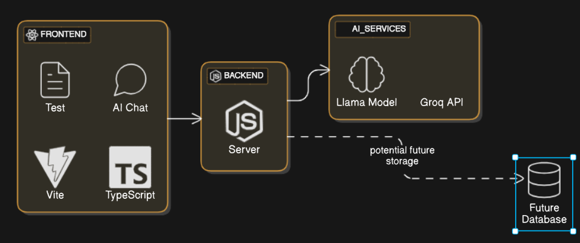

# CodeTest AI

An AI-powered VS Code extension for intelligent test case generation and code assistance.

see our extension:(https://marketplace.visualstudio.com/items?itemName=codetestai.codetestai)

### Team
Our team consists of:
- **Divyansh**
- **Raushan**
- **Shadab**

### Introduction
The AI-Powered Peer Programming Assistant is designed to provide real-time coding assistance by generating code, debugging errors, optimizing performance, and writing test cases. This report focuses on the assistant's UI design, user flows, database schema, and system architecture, ensuring a seamless user experience and efficient backend management.

### What is your product about?
Our product is an AI-driven peer programming assistant designed to work alongside developers, offering real-time coding assistance in any programming language. By leveraging artificial intelligence, the assistant enhances productivity, reduces debugging time, and provides intelligent suggestions, making coding more efficient and collaborative.

### Users
#### User Groups
Our primary users include:
- **Programmers (Only)**

#### Key Challenges Addressed
- Time-consuming learning curves for new programming languages.
- Difficulty in debugging and optimizing code.
- Enhancing collaboration in remote development environments (Future goal).

### Use Cases
- **Real-time Coding Assistance:** Provides live code suggestions and error fixes.
- **Multi-language Support:** Works with various programming languages.
- **Debugging and Optimization:** Identifies and resolves errors efficiently.
- **Collaborative Development:** Enables real-time interaction among developers.
- **Learning Aid:** Acts as a tutor for those new to programming.

## Differentiating Features

### 🧪 AI-Powered Test Generation
- Automatically generates up to 10 test cases for your code
- Supports multiple test categories (unit tests, edge cases, performance tests)
- Real-time test generation as you code
- Smart file tracking across editor tabs

### 💬 AI Chat Interface
- Chat with AI about your code
- Get instant code suggestions and improvements
- Accept or reject code suggestions directly
- Code block support with syntax highlighting

### ⚡ Quick Actions
- Generate tests with `Ctrl+Shift+T` / `Cmd+Shift+T`
- Run tests with `Ctrl+Shift+R` / `Cmd+Shift+R`
- Accept suggestions with `Ctrl+Shift+A` / `Cmd+Shift+A`
- Reject suggestions with `Ctrl+Shift+X` / `Cmd+Shift+X`
- Open chat with `Ctrl+Shift+C` / `Cmd+Shift+C`
- Debug tests with `Ctrl+Shift+D` / `Cmd+Shift+D`

### 🎯 Smart Test Management
- Modern tabbed interface
- Test case categorization
- Status indicators (pending/passed/failed)
- Code preview in formatted blocks
- Accept/reject functionality

### 🔄 Real-Time Updates
- Auto-detection of code changes
- Progress indicators
- Clear error notifications
- Success/failure status for each operation

## Installation

1. Open VS Code
2. Go to Extensions (Ctrl+Shift+X)
3. Search for "CodeTest AI"
4. Click Install

## Usage

1. Open a code file in VS Code
2. Click the CodeTest AI icon in the activity bar
3. Choose between Test Cases or AI Chat tabs
4. Start generating tests or chatting with AI about your code

### Auto-Detection Mode

1. Enable auto-detection using the toggle switch
2. Tests will be generated automatically as you code
3. View real-time status updates in the status bar
4. Accept or reject generated tests

### Manual Mode

1. Select the code you want to test
2. Press `Ctrl+Shift+T` to generate tests
3. Review and modify generated tests
4. Run tests with `Ctrl+Shift+R`

## Requirements

- VS Code version 1.85.0 or higher
- Node.js 18.x or higher

## Extension Settings

* `codetestai.autoDetect`: Enable/disable automatic test generation
* `codetestai.maxTestCases`: Maximum number of test cases to generate (default: 10)
* `codetestai.showStatusBar`: Show/hide status bar item

### HCI Principles Highlighted in the Product
- **User-Centric Design:** Tailored interactions based on developer needs.
- **Minimal Cognitive Load:** Ensures smooth navigation and easy access to features.
- **Feedback Mechanism:** Provides immediate and context-aware responses.
- **Multi-modal Interaction:** Supports text, voice, and graphical representations.

## User Segmentation
### Identify and Categorize Different Users
We currently focus on programmers of all skill levels. In the future, we may introduce user modes instead of categorizing by users.

### Identify Their Pain Points / Challenges / Needs / Preferences
- **Beginner Programmers:** Need clear explanations and interactive guidance.
- **Experienced Developers:** Require efficiency-boosting automation.
- **Educators & Tech Leads:** Need tools for reviewing and assisting students or team members.

### Prioritize Pain Points
#### MVP Priorities:
- **High Priority:** Reducing debugging complexity.
- **Medium Priority:** Enhancing multi-language support.
- **Low Priority:** Providing interactive learning features.

## Features
### High-Level Features that Address the Prioritized Pain Points
- **AI-Powered Code Generation:** Generates and refines code snippets.
- **Automated Debugging:** Highlights issues with solutions.
- **Customizable Assistance:** Allows users to tweak AI responses.
- **Unit Test Writing & Test Case Generation:** Automates testing to improve code quality.

### Unique Selling Point (USP)
- **Real-time AI assistance for debugging, test case generation, and code optimization.**

### Feature Prioritization
Using the **MoSCoW** method:
- **Must Have:** AI-powered test case generation, debugging, and real-time suggestions.
- **Should Have:** Collaborative coding features.
- **Could Have:** Integration with IDEs like VS Code, JetBrains.
- **Won't Have (for now):** AI voice coding assistance.

### User Flow and Interaction Design
#### 3.1 Code Writing & AI Assistance
- User writes code in the editor.
- AI provides suggestions, error detection, and auto-completions.
- The user can accept, modify, or reject suggestions.

#### 3.2 Test Case Generation
- AI analyzes the written code in real time.
- It generates test cases dynamically and presents them in the Test Case Generator Panel.
- The user can edit or accept test cases before execution.

#### 3.3 Debugging Workflow
- AI detects potential errors and displays them in the Debugging Console.
- Possible fixes and explanations are provided.
- The user applies fixes manually or accepts AI-generated solutions.

## System Design and Architecture

### System Components (Tech Stack):
- **Frontend:** React.js for an interactive UI.
- **Backend:** Node.js with Express for handling requests and AI interactions.
- **AI Engine:** Python-based LLM & NLP models for processing code.
- **Database:** MongoDB for storing user interactions and test cases. (We will be using it)
- **Authentication:** OAuth/Firebase Auth (Planned feature).

### Data Flow
- User interacts with the UI.
- Requests are sent to the backend.
- The AI engine processes input and generates suggestions.
- Responses are stored and displayed to the user.

### Future Enhancements
- **Cloud Scalability:** Implementing Microsoft Azure for AI model deployment, scaling, and serverless computing.
- **Database Optimization:** Using Redis for caching frequently accessed AI responses.
- **Multi-Tenant Support:** Allowing multiple developers to collaborate within a single AI instance.
- **IDE Integrations:** Direct integration with JetBrains and VS Code.
- **Enhanced AI Models:** Transitioning to more efficient models for faster responses.
- **Auto Documentation:** AI-powered code documentation generation.

## Conclusion
The AI-powered peer programming assistant aims to enhance developer efficiency through an intelligent, adaptive, and user-friendly interface. By focusing on real-time test case generation, debugging, and coding assistance, this system significantly improves the coding experience. 

### Future Roadmap:
1. **Short-term:**
   - Implement Microsoft Azure for hosting AI models.
   - Improve UI/UX for smoother AI interactions.
   - Develop a robust authentication system.
2. **Mid-term:**
   - Support for real-time multi-user collaboration.
   - Enhanced multi-language support.
3. **Long-term:**
   - AI-powered refactoring suggestions.
   - Expanding to voice-based coding assistance.
   - Launching a commercial SaaS version.

By continuously evolving the system, we aim to make AI-assisted coding more effective and widely accessible to developers worldwide.

## Known Issues

Please report any issues on our [GitHub repository](https://github.com/codetestai/codetestai/issues).

## Contributing

1. Fork the repository
2. Create a feature branch
3. Commit your changes
4. Push to the branch
5. Create a Pull Request

## License

This project is licensed under the MIT License - see the LICENSE file for details.
